# Qabilati

[](https://deepwiki.com/MansourSayed2002/qabilati_dev)

Qabilati is a comprehensive social communication application built with Flutter. It enables users to connect with friends and communities through real-time chat, group conversations, voice/video calls, and more, all powered by a robust Supabase backend.

## 🖼️ Pictures from the application

### 🔐 splash page
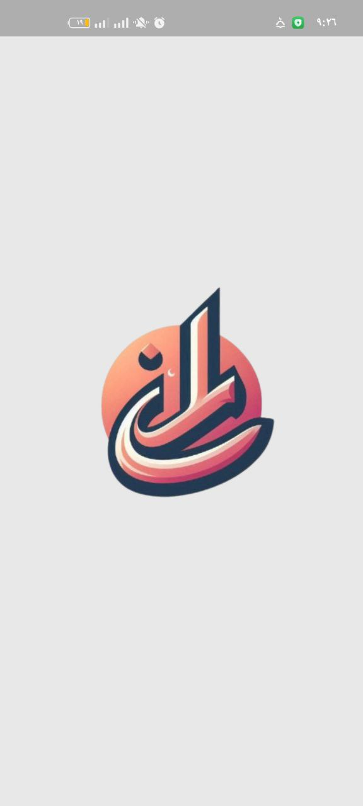
### 🔐 onboarding page
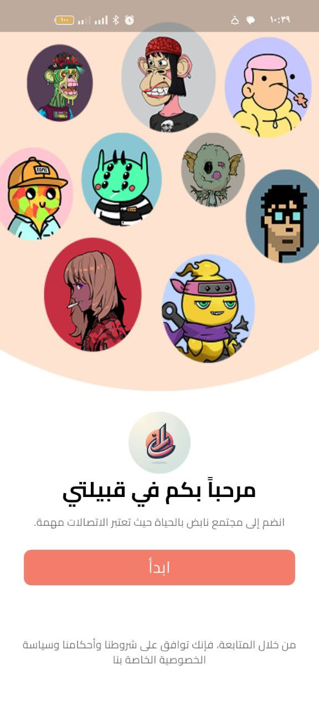
### 🔐 auth page

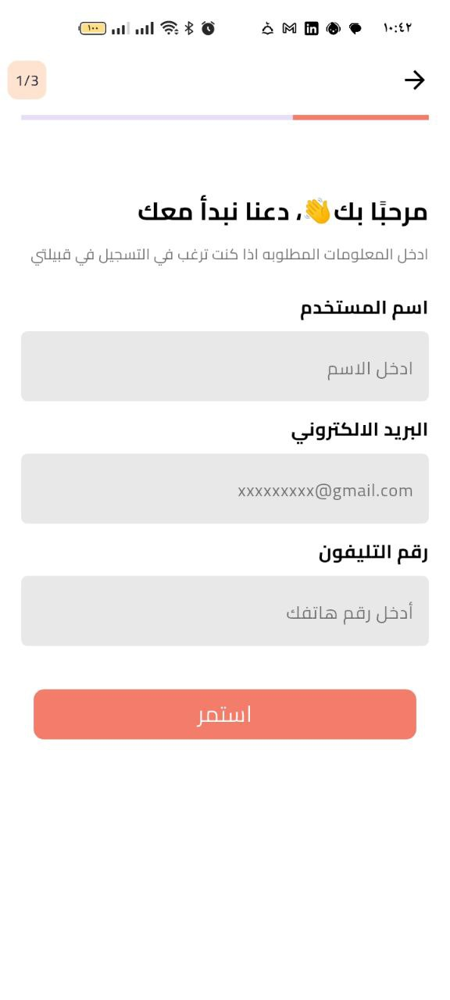

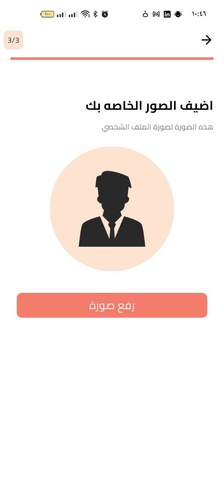
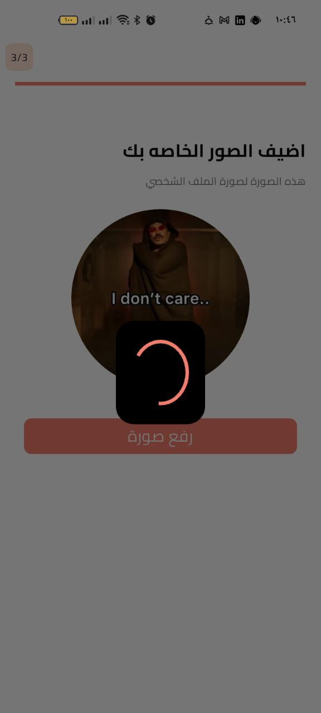
### 🔐 home page

### 🔐 friend page
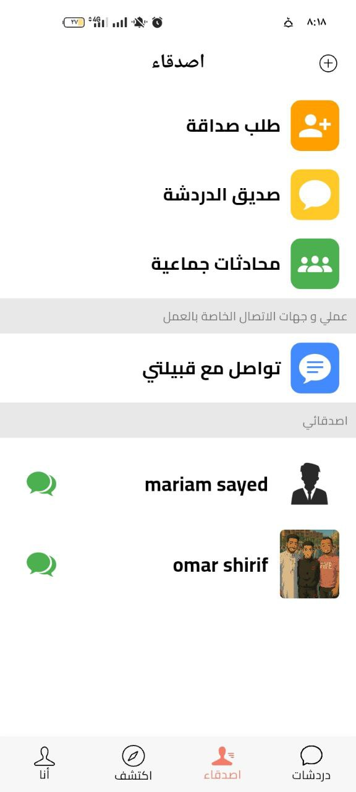
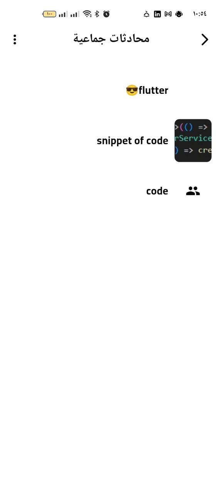
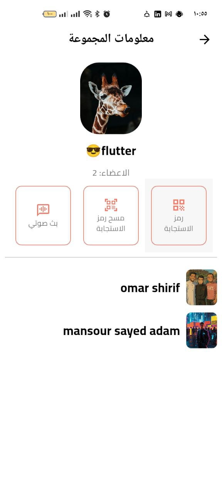


### 🔐 chat groub page
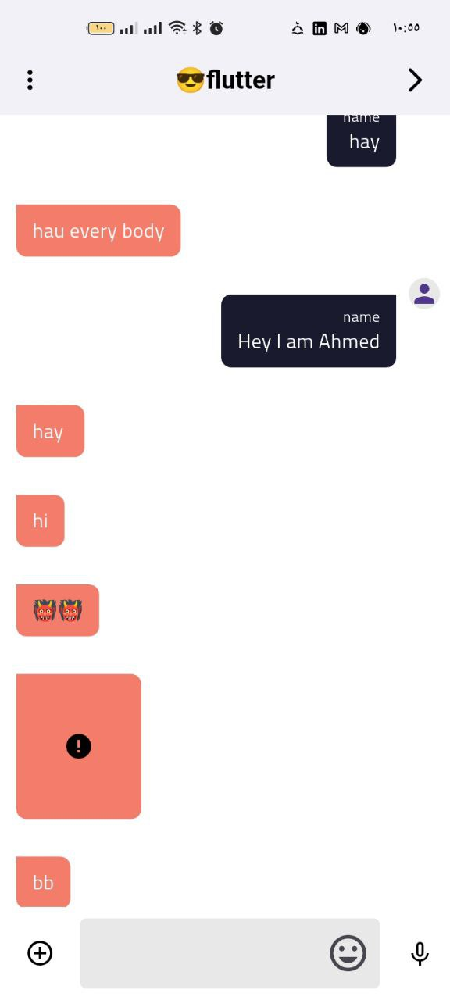
### 🔐 chat page
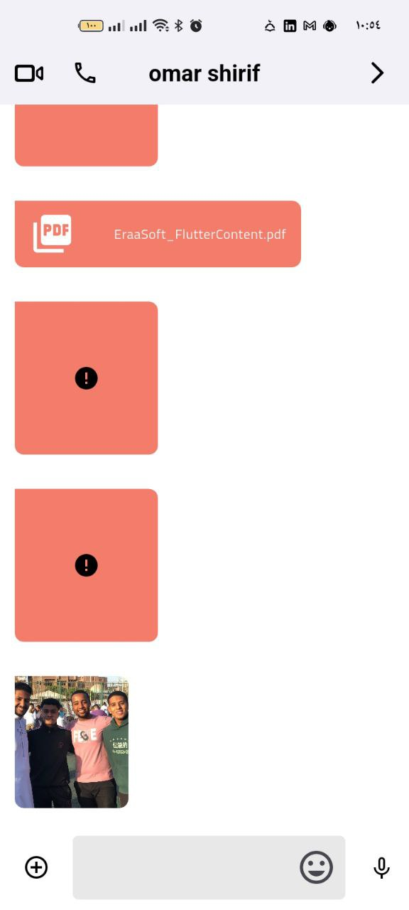
### 🔐 posts page
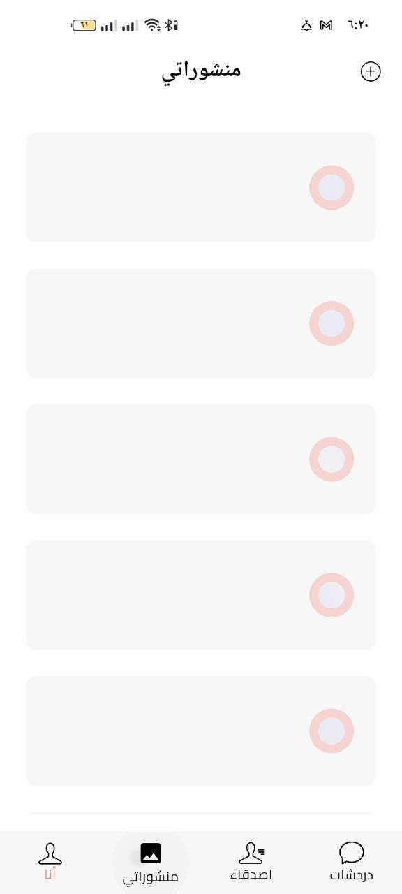


### 🔐 me page

### 🔐 wallet page

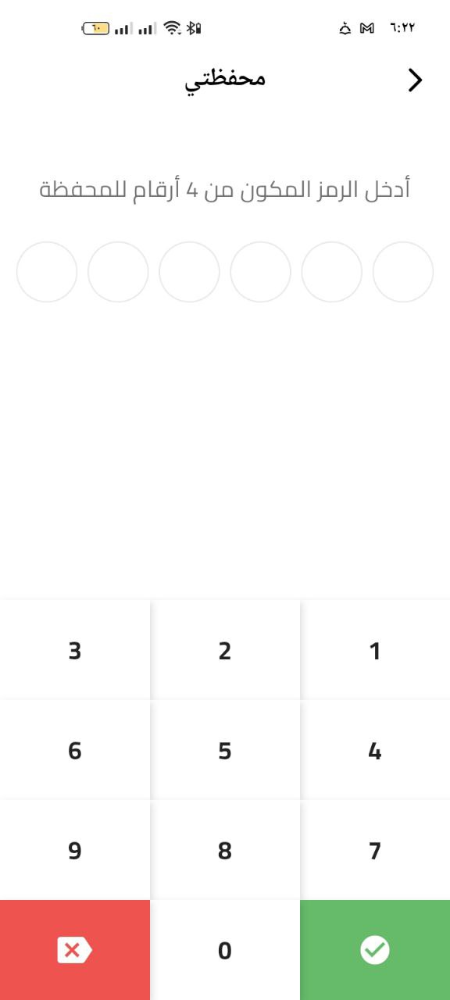
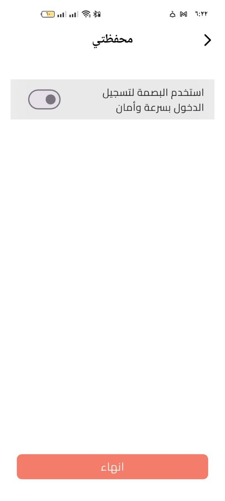
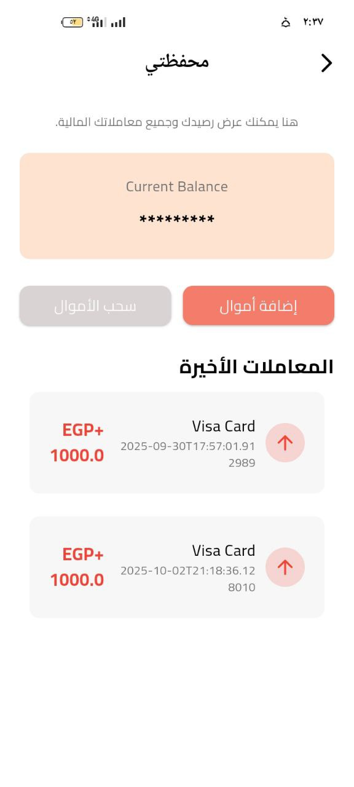

### 🔐 qr code page
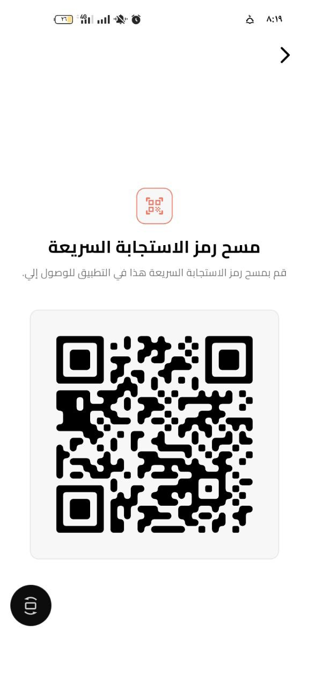
### 🔐 search page

## Features

-   **Authentication**: Secure user registration, login, and email verification.
-   **Real-time Chat**:
    -   One-on-one and group chat functionalities.
    -   Real-time messaging powered by Supabase Realtime subscriptions.
    -   Multimedia support: send text, images, videos, PDFs, and voice notes.
    -   Emoji picker and voice message recording.
-   **Voice & Video Calls**: Integrated in-app calls using Zego Cloud's prebuilt UI kits.
-   **Friendship System**:
    -   Search for users.
    -   Send, accept, or reject friend requests.
    -   View friends list and pending requests.
-   **User Profiles**:
    -   Customizable profile with an image and user details.
    -   Unique QR code for each user for easy profile sharing and adding friends.
-   **Notifications**: Push notifications for friend requests and other events, implemented with Firebase Cloud Messaging (FCM).
-   **Internationalization**: Support for both Arabic and English languages.
-   **Build Flavors**: Separate entry points for development (`main_development.dart`) and production (`main_production.dart`) environments.

## Tech Stack

-   **Framework**: Flutter
-   **Backend**: Supabase (Authentication, PostgreSQL Database, Storage, Realtime)
-   **State Management**: Flutter Bloc
-   **Dependency Injection**: GetIt
-   **Calling SDK**: Zego Cloud (ZegoUIKitPrebuiltCall)
-   **Push Notifications**: Firebase Cloud Messaging (FCM)
-   **Local Storage**: Hive & SharedPreferences
-   **Routing**: Native Flutter Navigator
-   **Localization**: `flutter_intl`
-   **UI**: `flutter_screenutil`, `pinput`, `emoji_picker_flutter`, `cached_network_image`
-   **Hardware Integration**: `image_picker`, `file_picker`, `record`, `mobile_scanner`

## Project Structure

The project follows a feature-driven architecture, promoting separation of concerns and scalability.

```
lib
├── core/            # Shared logic, utilities, classes, and widgets
├── feature/         # Individual app features
│   ├── auth/        # Authentication feature
│   ├── chat_room/   # 1-to-1 chat feature
│   ├── chats/       # List of all chats
│   ├── friends/     # Friend management
│   └── ...          # Other features (profile, search, etc.)
│
├── generated/       # Auto-generated localization files
├── l10n/            # Localization source files (.arb)
├── main_development.dart
└── main_production.dart
```

Each feature folder is structured into three main layers:
-   **`data`**: Contains the repository implementation and data source (API) logic.
-   **`domain`**: Holds the repository abstractions (interfaces) and use cases.
-   **`presentation`**: Includes the UI (screens/widgets) and state management (Cubits).

## Configuration

Before running the application, you need to set up your environment variables.

1.  Create a file named `.env` in the root of the project.
2.  Add your credentials from Supabase, Firebase, and Zego Cloud:

    ```env
    # Supabase
    SUPABASE_URL=YOUR_SUPABASE_URL
    SUPABASE_ANON_KEY=YOUR_SUPABASE_ANON_KEY

    # Firebase
    FCM_URL=https://fcm.googleapis.com/v1/projects/YOUR_PROJECT_ID/messages:send

    # Zego Cloud
    APP_ID_ZEGO=YOUR_ZEGO_APP_ID
    APP_SIGN_ZEGO=YOUR_ZEGO_APP_SIGN

    # EmailJS for verification codes
    EMAILJS_SERVICE_ID=YOUR_EMAILJS_SERVICE_ID
    EMAILJS_TEMPLATE_ID=YOUR_EMAILJS_TEMPLATE_ID
    EMAILJS_USER_ID=YOUR_EMAILJS_USER_ID
    EMAILJS_TOKEN=YOUR_EMAILJS_ACCESS_TOKEN

    # Supabase Storage Public URLs
    SUPABASE_URL_IMAGE=YOUR_SUPABASE_URL/storage/v1/object/public/image/
    SUPABASE_URL_RECORD=YOUR_SUPABASE_URL/storage/v1/object/public/record/
    SUPABASE_URL_VIDEO=YOUR_SUPABASE_URL/storage/v1/object/public/video/
    ```

## Getting Started

To get a local copy up and running, follow these simple steps.

1.  **Clone the repository:**
    ```sh
    git clone https://github.com/mansoursayed2002/qabilati_dev.git
    cd qabilati_dev
    ```

2.  **Set up your environment:**
    -   Ensure you have the Flutter SDK installed.
    -   Create and populate the `.env` file as described in the **Configuration** section.

3.  **Install dependencies:**
    ```sh
    flutter pub get
    ```

4.  **Run the application using the desired flavor:**

    -   **Development:**
        ```sh
        flutter run --flavor development -t lib/main_development.dart
        ```

    -   **Production:**
        ```sh
        flutter run --flavor production -t lib/main_production.dart
